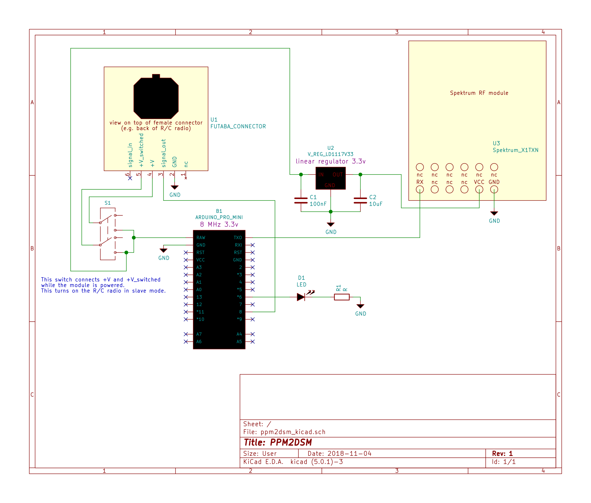

PPM2DSM
=======

This is an Arduino project that allows adding Spektrum DSM transmission capability to a PPM-capable R/C radio.

It is a complete rewrite of the "PPM to DSM v1.07" sketch that can be found on various forums.

The motivation of this project is to fly bind-and-fly models from Horizon Hobby (Spektrum) without having to settle for the limited featureset and quality of my DX6i. Thanks to this project, i can utilize the high quality gimbals, enhanced mixers, timers and the ability to fly in Modes 3 and 4 of my Futaba T14SG.

Features
--------

- supports six channels
- rearranges channel order (pre-setup for futaba)
- controlled entirely through the R/C remote, no additional physical button needed
- diagnostic LED
- bind mode via stick gesture
- seventh input channel allows controlling the module:
  - ModelMatch
  - bind mode via switch on the R/C remote

Hardware
--------

Spektrum R/C transmitters, such as the DX6i, contain removable RF modules (X1TXN in my case). They receive instructions over a serial connection. For this project, the RF module is removed and connected to an arduino pro mini 3.3v 8mhz is connected to the RF module.

The new R/C transmitter (Futaba T14SG in my case) is setup in trainer mode as a slave, which causes it to output a PPM signal. This signal is connected to the arduino.

Finally, a LED is connected to the arduino. This allows troubleshooting.

Pin assignment
--------------

- TX: serial output
- Pin 8: PPM input
- Pin 6: diagnostic LED

Pin numbers can be changed in [Defines.h](src/Defines.h)

Example schmematic
------------------

Of course, this schematic is by no means the only working one. Different voltage converter or switch setups are certainly possible. Even a different microcontroller should be possible. E.g. a 16MHz 5v pro mini should work just fine, as long as the firmware is built for 16MHz and the voltage of the serial connection is somehow stepped down to prevent damage to the RF module.

Building
--------

This program was developed using [PlatformIO](https://platformio.org/) IDE. The easiest way to build it is to download and install PlatformIO, load the project and hit compile! It was tested on PlatformIO 3.6.1rc7 in conjunction with Visual Studio Code 1.28.2. The project uses the framework `atmelavr` and it was tested using version 1.10.1.

Building with the Arduino IDE should also be possible, but this was not tested.

Alternatively, check out the [releases section for pre-built binaries.](../../releases/)

Usage
-----

| LED pattern               | meaning                                     |
| --------------------------|---------------------------------------------|
| off                       | module is working properly                  |
| on                        | no valid PPM signal received                |
| blinking rapidly          | bind mode                                   |
| flashing slowly 1-10 times | module has changed to indicated model number|

### Gesture-based bind mode

Bind mode can be entered by holding both sticks in any corner while the module is powered on. Specifically, the arduino checks the first four channels and if none of them are centered, bind mode is activated.

The bind mode stays active for a few seconds and then it is disabled automatically. The diagnostic LED can be very helpful to verify that this feature is working.

Gesture-based bind mode was carefully designed to put the RF module into bind mode on power-up, without a single non bind-mode packet ever sent to the RF module. Experience shows the X1TXN RF-module requires this.

### ModelMatch and control channel

ModelMatch works as follows:
The RF module contains 10 different IDs. Receivers are **not** bound to a RF module, but to an ID. Every model should be bound to a different ID. Therefore, if the wrong model is selected on the R/C transmitter, the model will not receive any signal. This is a very obvious failure condition and it will remind the pilot to select the correct model on the remote.

The Arduino has to tell the RF module which ID it should use. To bind IDs to storage slots in he R/C remote, the R/C remote has to tell the Arduino which storage slot is selected. This is is done using the control channel (channel 7).

Channel 7 is split into two halves, and each half is split into 10 ranges for the 10 IDs. The layout is arranged as follows:

      no bind                   1550us                     bind
      9  8  7  6  5  4  3  2  1  0  1  2  3  4  5  6  7  8  9
      926us ------------------ 1513us -------------------- 2100us

When the control channel is centered, model 0 is selected. The further the control channel moves from the center, the higher the selected model number.
The control channel also controls whether or not bind mode should be active. If the channel is in its upper half (longer pulses 1550us), bind mode is active.

The intention behind this layout is simplicity when programming the R/C remote: Using end-point adjustment, channel 7 can be constrained to reach the appropriate levels both in the upper and lower half of the channel. Then, a switch is assigned to the channel. The switch allows switching between model 5 in bind mode and model 5 in normal mode.

Please note that model number changes are only recognized **slowly**. Specifically, a new model number is only accepted after 20 consecutive repetitions of the same new model number selection. This was added to prevent any glitches in the PPM signal from rapidly changing the model number.

Resources
---------

http://www.demoboard.de/projekte/ppm2dsm/

https://www.rc-heli.de/board/showthread.php?t=189853

http://www.hacksmods.com/2011/12/spektrum-dsm2-module-from-hp6dsm/
